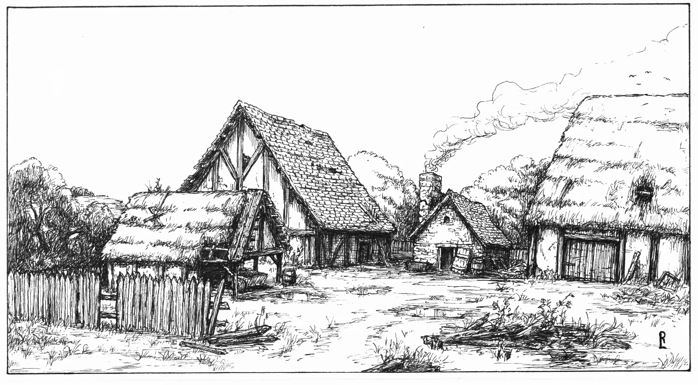
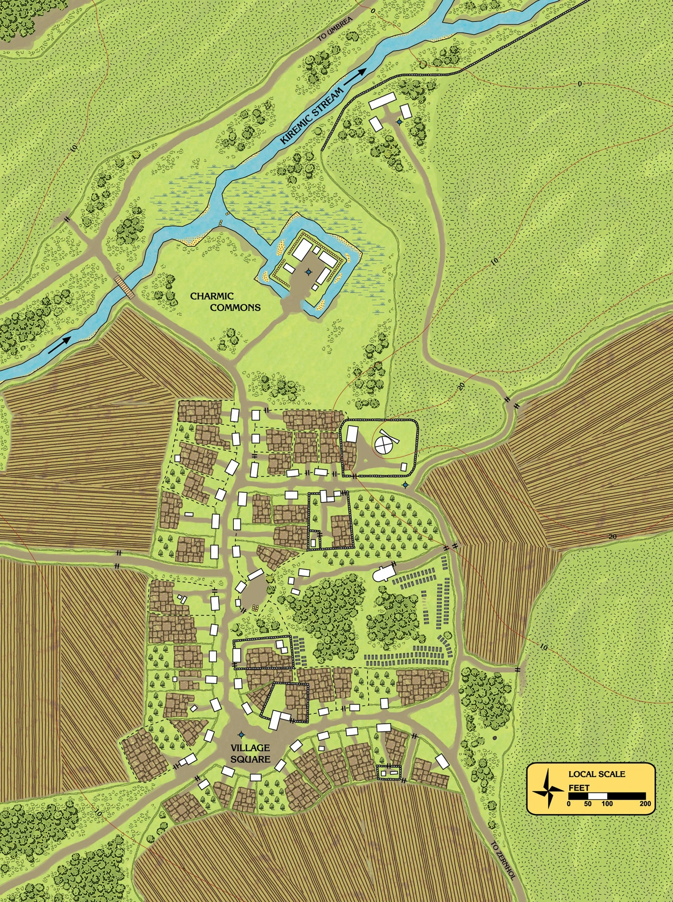
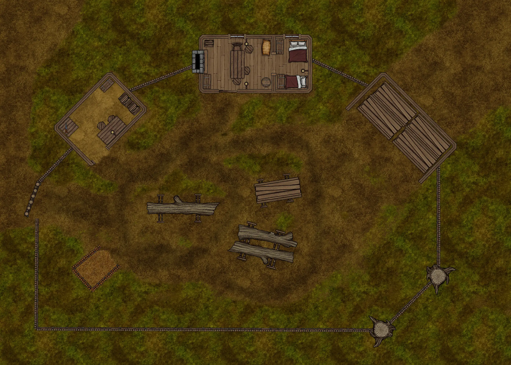
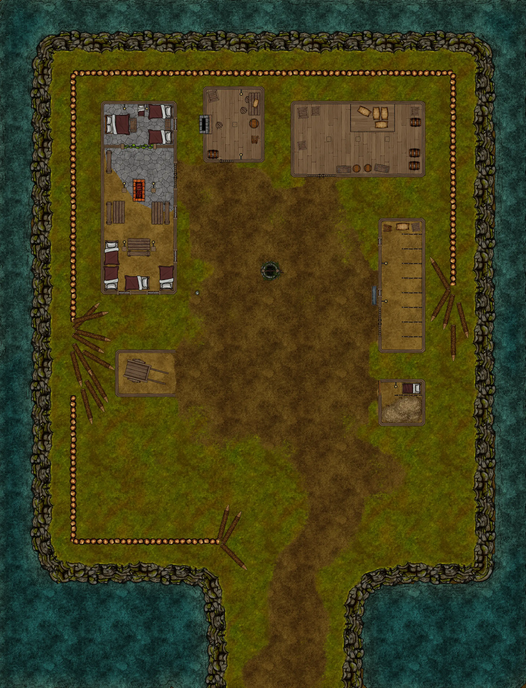

# HârnWorld Location Module: Charmic Manor

[)].download_count&url=https://api.github.com/repos/toastygm/hm-loc-charmic/releases/latest&color=green)](https://github.com/toastygm/hm-loc-charmic/releases/latest)

Charmic Manor is a "Location Module" for the Foundry VTT system. This location module
is designed to depict the Charmic Manor in the far north of the Kingdom of Kaldor, on
the island of Hârn in the [HârnWorld](https://columbiagames.com/harnworld/) fantasy
setting; however, this manor could be adapted to exist anywhere in any fantasy setting.

Although designed for use with the [HârnMaster](https://foundryvtt.com/packages/hm3)
system, this module is mostly system-agnostic.  Detailed descriptions of the actors
has been provided in journal entries to facilitate conversion to other game systems.

This manor is held directly by the Earl of Neph and managed by a bailiff. It is a
relatively new manor with huge potential, and grew very prosperous under its
original bailiff. But in recent years, it has become a dark and dangerous place. 

# Maps

The original maps from this work have been used as inspiration, and new maps have been
designed specifically to meet the requirements of the VTT environment.  The following
maps are part of this module.

## Charmic Village

Map of Charmic Village, including the manor.

## Timberwright's Yard

## Charmic Manor

# Credits

This module is made possible by the hard work of HârnWorld fans,
and is provided at no cost. This work is an adaptation of the article
[Charmic Manor]()https://www.lythia.com/harnworld/settlements/charmic/ available
at the HârnWorld fan site [Lythia.com](https://www.lythia.com/).

**Writer:** Kerry Mould

**Original Maps:** Patrick Nilsson

**Artist:** Richard Luschek

**Adapted to Foundry VTT:** Tom Rodriguez

This module is "[Fanon](https://www.lythia.com/about/publishing-fan-written-material/)",
a derivative work of copyrighted material by Columbia Games Inc. and N. Robin Crossby.

Some assets used to create the maps in this module are from
[Forgotton Adventures](https://www.forgotten-adventures.net/).
Illustrations by Richard Luschek; visit his Patreon page at https://www.patreon.com/LuschekII.
